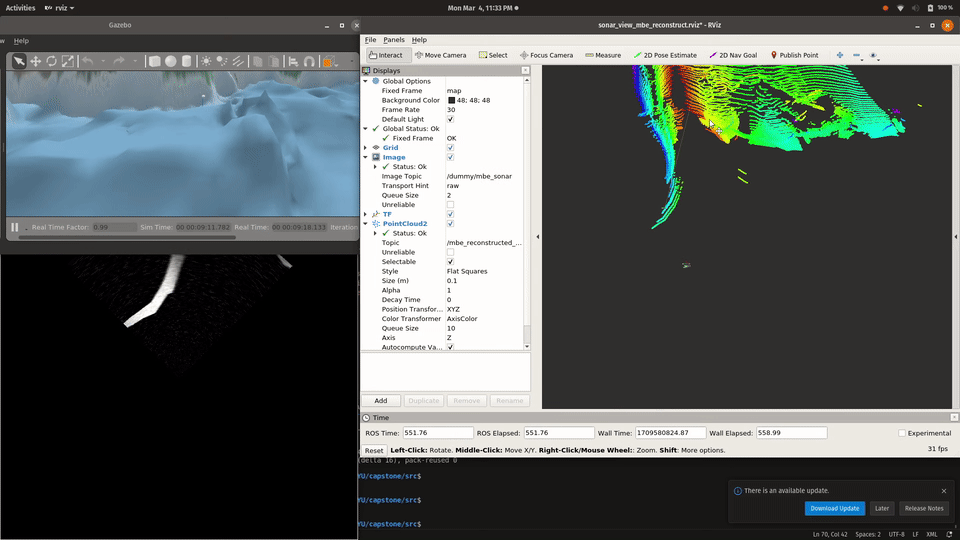

# sonar_testing

This ROS package is for testing sonar-related features of the ROV without needing the full simulation. It is made possible with the [Brazilian Institute of Robotics](https://github.com/Brazilian-Institute-of-Robotics)'s GPU sonar plugin. 

There are two parts to this package (refer to [Usage](#usage) for more details):
-   [Sonar simulation](#sonar-simulation): Gazebo sonar simulation and dummy robot for testing controls
-   [Sonar processing & 3D reconstruction](#sonar-processing--3d-reconstruction): Scripts to convert sonar fan shape to rectangular shape, and to retrieve point cloud based on [Cho's 2017 paper](https://ieeexplore.ieee.org/document/8058441).


## Dependencies
### System ROS
Run the following to install any missing system packages:
```
sudo apt install ros-melodic-std-msgs ros-melodic-geometry-msgs ros-melodic-sensor-msgs ros-melodic-message-to-tf ros-melodic-robot-state-publisher ros-melodic-image-transport ros-melodic-cv-bridge 
```

### External
The following external packages are needed (all ROS):

-   [forward_looking_sonar_gazebo](https://github.com/CapstoneROV/forward_looking_sonar_gazebo) fork of repo by Brazilian Institute of Robotics
-   [sonar_msgs](https://github.com/Brazilian-Institute-of-Robotics/sonar_msgs) by Brazilian Institute of Robotics
-   [pointcloud_registration](https://github.com/CapstoneROV/pointcloud_registration) fork of CameronDevine's code of old ROS package

You can `git clone` them into your ROS workspace's `src` folder, next to your other ROS packages:

```
git clone https://github.com/CapstoneROV/forward_looking_sonar_gazebo
git clone https://github.com/Brazilian-Institute-of-Robotics/sonar_msgs
git clone -b PointXYZ https://github.com/CapstoneROV/pointcloud_registration
```

## Usage
### Sonar simulation
#### Running
The simulation can be run by:

```
roslaunch sonar_testing dummy.launch
```

#### Control
The box listens to topic `/dummy/goal` for a `PoseStamped` message telling it where to go to. This message can be published with a Publisher or via the command line. For example:

```
rostopic pub /dummy/goal geometry_msgs/PoseStamped '{header: {stamp: now, frame_id: "map"}, pose: {position: {x: 1.0, y: 0.0, z: 2.0}, orientation: {w: 1.0, x: 0.0, y: 0.0, z: 0.0}}}'
```

#### Sonars
The dummy box has 2 sonars attached representative of the MBE and the Ping360 sonars. The sonars are mounted in [`robots/dummy.urdf.xacro`](./robots/dummy.urdf.xacro), and their configurations can be modified in [`models/sonars.urdf.xacro`](./models/sonars.urdf.xacro). By default, they publish their image streams (fan-shaped) on topics `/dummy/mbe_sonar` and `/dummy/ping360_sonar`.


In addition, a Ping2 echosounder is also mounted in [`robots/dummy.urdf.xacro`](./robots/dummy.urdf.xacro), and it uses a downward-looking `ray` sensor with only 1 beam. It publishes a LaserScan message to the topic `/dummy/ping2`.

#### Point cloud
The simulation includes a point cloud from the `ping360_sonar_link` using the Kinect depth camera plugin. The characteristics of the depth camera is similar to the Ping360 sonar and can be modified in the URDF file. The point cloud is published on topic `/dummy/ping360_sim_depth/depth/points`, and the update rate is set to 1Hz.


### Sonar processing & 3D reconstruction
Two nodes are implemented for this part:

-   The `sonar_transformer` node, which takes in a fan-shaped sonar image and convert it to a rectangular image. The format is `beam_count` x `bin_count` (width x height), with beams 0 at the rightmost edge of the fan-shaped image. Refer to the `dummy.launch` or `sonar_transformer.launch` for its list of parameters.

-   The `3d_reconstruction` node, which takes in a rectangular image and reconstructs a pointcloud line scan of the floor. This can then be sent to the ICP registration of the external `pointcloud_registration` package to form the global mesh.

These nodes can all be run with:

```
roslaunch sonar_testing dummy_mbe_recon.launch
```

The dummy robot can then be moved to see the effect of the 3D reconstruction.

