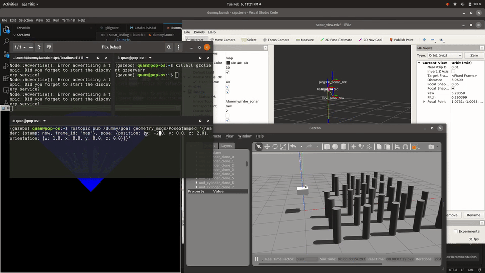
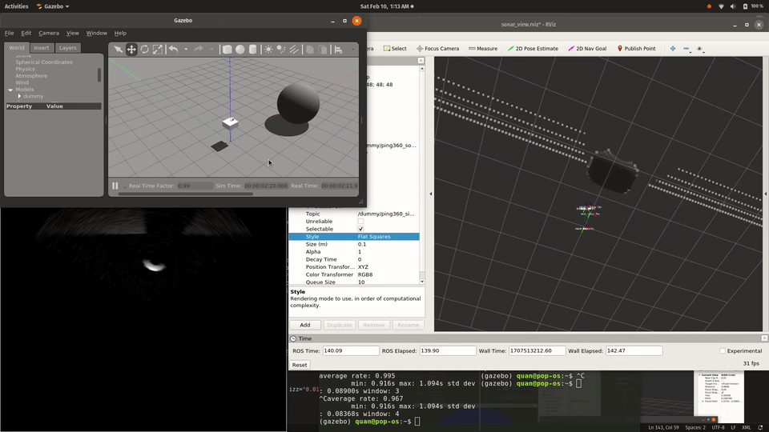

# sonar_testing

This ROS package is for testing sonar-related features of the ROV without needing the full simulation. It is made possible with the [Brazilian Institute of Robotics](https://github.com/Brazilian-Institute-of-Robotics)'s GPU sonar plugin. Refer to the [Usage](#usage) section for more operational details.

## Dependencies
### System ROS
Run the following to install any missing system packages:
```
sudo apt install ros-melodic-std-msgs ros-melodic-geometry-msgs ros-melodic-sensor-msgs ros-melodic-message-to-tf ros-melodic-robot-state-publisher ros-melodic-image-transport ros-melodic-cv-bridge 
```

### External
You can install [vcstool](https://github.com/dirk-thomas/vcstool) and install the third-party packages as follows (from your ROS workspace's `src` folder):

```
# From your_workspace/src
pip install vcstool
vcs import < ./sonar_testing/dependencies.repos
```

Alternatively, you can just `git clone` them next to your other ROS packages:

-   [forward_looking_sonar_gazebo](https://github.com/CapstoneROV/forward_looking_sonar_gazebo) fork of repo by Brazilian Institute of Robotics
-   [sonar_msgs](https://github.com/Brazilian-Institute-of-Robotics/sonar_msgs) by Brazilian Institute of Robotics

## Usage
### Running
The simulation can be run by:

```
roslaunch sonar_testing dummy.launch
```

### Control
The box listens to topic `/dummy/goal` for a `PoseStamped` message telling it where to go to. This message can be published with a Publisher or via the command line. For example:

```
rostopic pub /dummy/goal geometry_msgs/PoseStamped '{header: {stamp: now, frame_id: "map"}, pose: {position: {x: 1.0, y: 0.0, z: 2.0}, orientation: {w: 1.0, x: 0.0, y: 0.0, z: 0.0}}}'
```

### Sonars
The dummy box has 2 sonars attached representative of the MBE and the Ping360 sonars. Their configurations can be modified in the [`dummy.urdf`](./urdf/dummy.urdf) file. By default, they publish their image streams (fan-shaped) on topics `/dummy/mbe_sonar` and `/dummy/ping360_sonar`.



### Point cloud
The simulation includes a point cloud from the `ping360_sonar_link` using the Kinect depth camera plugin. The characteristics of the depth camera is similar to the Ping360 sonar and can be modified in the URDF file. The point cloud is published on topic `/dummy/ping360_depth/depth/points`, and the update rate is set to 1Hz.

